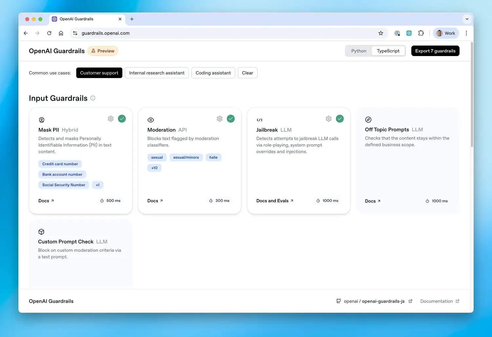

# OpenAI Guardrails: TypeScript (Preview)

This is the TypeScript version of OpenAI Guardrails, a package for adding configurable safety and compliance guardrails to LLM applications. It provides a drop-in wrapper for OpenAI's TypeScript / JavaScript client, enabling automatic input/output validation and moderation using a wide range of guardrails.

Most users can simply follow the guided configuration and installation instructions at [guardrails.openai.com](https://guardrails.openai.com/).

[](https://guardrails.openai.com)

## Installation

### Usage

Follow the configuration and installation instructions at [guardrails.openai.com](https://guardrails.openai.com/).


### Local Development

Clone the repository and install locally:

```bash
# Clone the repository
git clone https://github.com/openai/openai-guardrails-js.git
cd openai-guardrails-js

# Install dependencies
npm install

# Build the package
npm run build
```

## Integration Details

### Drop-in OpenAI Replacement

The easiest way to use Guardrails TypeScript is as a drop-in replacement for the OpenAI client:

```typescript
import { GuardrailsOpenAI } from '@openai/guardrails';

async function main() {
  // Use GuardrailsOpenAI instead of OpenAI
  const client = await GuardrailsOpenAI.create({
    version: 1,
    output: {
      version: 1,
      guardrails: [{ name: 'Moderation', config: { categories: ['hate', 'violence'] } }],
    },
  });

  try {
    const response = await client.responses.create({
      model: 'gpt-5',
      input: 'Hello world',
    });

    // Access OpenAI response directly
    console.log(response.output_text);
  } catch (error) {
    if (error.constructor.name === 'GuardrailTripwireTriggered') {
      console.log(`Guardrail triggered: ${error.guardrailResult.info}`);
    }
  }
}

main();
```

### Agents SDK Integration

```typescript
import { GuardrailAgent } from '@openai/guardrails';
import { run } from '@openai/agents';

// Create agent with guardrails automatically configured
const agent = new GuardrailAgent({
  config: {
    version: 1,
    output: {
      version: 1,
      guardrails: [{ name: 'Moderation', config: { categories: ['hate', 'violence'] } }],
    },
  },
  name: 'Customer support agent',
  instructions: 'You are a helpful customer support agent.',
});

// Use exactly like a regular Agent
const result = await run(agent, 'Hello, can you help me?');
```

## Evaluation Framework

The evaluation framework allows you to test guardrail performance on datasets and measure metrics like precision, recall, and F1 scores.

### Running Evaluations

**Using the CLI:**

```bash
npm run build
npm run eval -- --config-path src/evals/sample_eval_data/nsfw_config.json --dataset-path src/evals/sample_eval_data/nsfw_eval.jsonl
```

### Dataset Format

Datasets must be in JSONL format, with each line containing a JSON object:

```json
{
  "id": "sample_1",
  "data": "Text to evaluate",
  "expectedTriggers": {
    "guardrail_name_1": true,
    "guardrail_name_2": false
  }
}
```

### Programmatic Usage

```typescript
import { GuardrailEval } from '@openai/guardrails';

const eval = new GuardrailEval(
  'configs/my_guardrails.json',
  'data/demo_data.jsonl',
  32, // batch size
  'results', // output directory
  false // multi-turn mode (set to true to evaluate conversation-aware guardrails incrementally)
);

await eval.run('Evaluating my dataset');
```

### Project Structure

- `src/` - TypeScript source code
- `dist/` - Compiled JavaScript output
- `src/checks/` - Built-in guardrail checks
- `src/evals/` - Evaluation framework
- `examples/` - Example usage and sample data

## Examples

The package includes comprehensive examples in the [`examples/` directory](https://github.com/openai/openai-guardrails-js/tree/main/examples):

- **`agents_sdk.ts`**: Agents SDK integration with GuardrailAgent
- **`hello_world.ts`**: Basic chatbot with guardrails using GuardrailsOpenAI
- **`azure_example.ts`**: Azure OpenAI integration example
- **`local_model.ts`**: Using local models with guardrails
- **`streaming.ts`**: Streaming responses with guardrails
- **`suppress_tripwire.ts`**: Handling guardrail violations gracefully

### Running Examples

#### Prerequisites

Before running examples, you need to build the package:

```bash
# Install dependencies (if not already done)
npm install

# Build the TypeScript code
npm run build
```

#### Running Individual Examples

**Using tsx (Recommended)**

```bash
npx tsx examples/basic/hello_world.ts
npx tsx examples/basic/streaming.ts
npx tsx examples/basic/agents_sdk.ts
```

## Available Guardrails

The TypeScript implementation includes the following built-in guardrails:

- **Moderation**: Content moderation using OpenAI's moderation API
- **URL Filter**: URL filtering and domain allowlist/blocklist
- **Contains PII**: Personally Identifiable Information detection
- **Hallucination Detection**: Detects hallucinated content using vector stores
- **Jailbreak**: Detects jailbreak attempts
- **Off Topic Prompts**: Ensures responses stay within business scope
- **Custom Prompt Check**: Custom LLM-based guardrails

## License

MIT License - see LICENSE file for details.

## Disclaimers

Please note that Guardrails may use Third-Party Services such as the [Presidio open-source framework](https://github.com/microsoft/presidio), which are subject to their own terms and conditions and are not developed or verified by OpenAI.  For more information on configuring guardrails, please visit: [guardrails.openai.com](https://guardrails.openai.com/)

Developers are responsible for implementing appropriate safeguards to prevent storage or misuse of sensitive or prohibited content (including but not limited to personal data, child sexual abuse material, or other illegal content). OpenAI disclaims liability for any logging or retention of such content by developers. Developers must ensure their systems comply with all applicable data protection and content safety laws, and should avoid persisting any blocked content generated or intercepted by Guardrails. Guardrails calls paid OpenAI APIs, and developers are responsible for associated charges.
