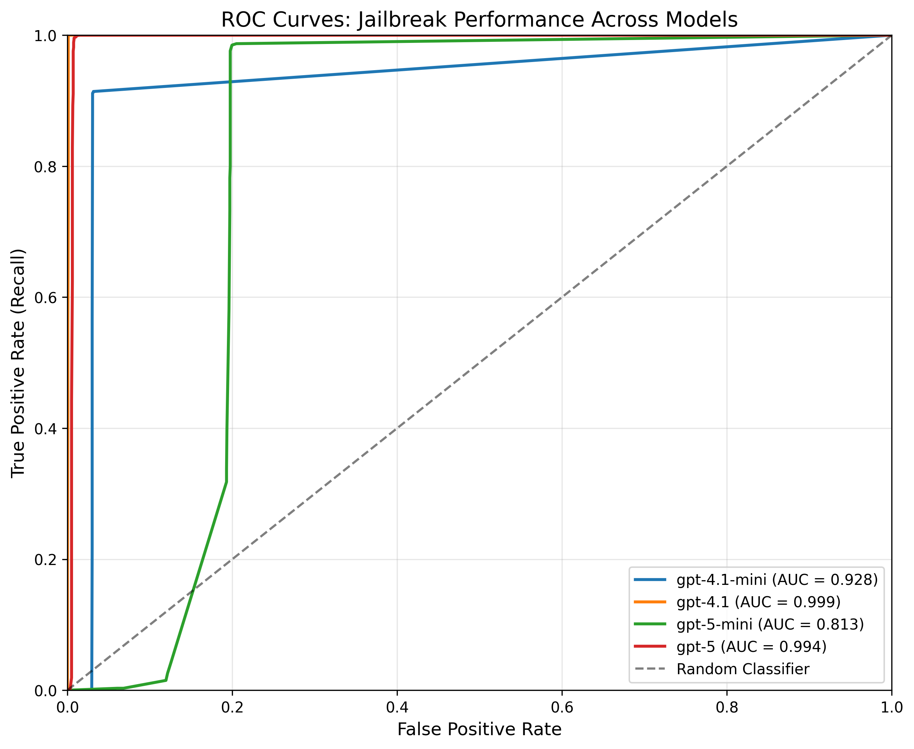

# Jailbreak Detection

Identifies attempts to bypass AI safety measures such as prompt injection, role-playing requests, or social engineering attempts. Analyzes text for jailbreak attempts using LLM-based detection, identifies various attack patterns, and provides confidence scores for detected attempts.

**Multi-turn Support**: This guardrail is conversation-aware and automatically analyzes conversation history to detect multi-turn escalation patterns, where adversarial attempts gradually build across multiple conversation turns.

## Jailbreak Definition

Detects attempts to bypass safety or policy constraints via manipulation. Focuses on adversarial intent to elicit restricted outputs, not on general harmful content itself.

### What it detects

Jailbreak detection focuses on **deception and manipulation tactics** designed to bypass AI safety measures, including:

- Attempts to override or bypass system instructions and safety constraints
- Obfuscation techniques that disguise harmful intent
- Role-playing, fictional framing, or contextual manipulation to justify restricted content
- Multi-turn escalation patterns where adversarial requests build gradually across conversation history
- Social engineering and emotional manipulation tactics

## Configuration

```json
{
    "name": "Jailbreak",
    "config": {
        "model": "gpt-4.1-mini",
        "confidence_threshold": 0.7,
        "include_reasoning": false,
        "max_turns": 10
    }
}
```

### Parameters

- **`model`** (required): Model to use for detection (e.g., "gpt-4.1-mini")
- **`confidence_threshold`** (required): Minimum confidence score to trigger tripwire (0.0 to 1.0)
- **`include_reasoning`** (optional): Whether to include reasoning/explanation fields in the guardrail output (default: `false`)
    - When `false`: The LLM only generates the essential fields (`flagged` and `confidence`), reducing token generation costs
    - When `true`: Additionally, returns detailed reasoning for its decisions
    - **Use Case**: Keep disabled for production to minimize costs; enable for development and debugging
    - **Performance**: In our evaluations, disabling reasoning reduces median latency by 40% on average (ranging from 18% to 67% depending on model) while maintaining detection performance
- **`max_turns`** (optional): Maximum number of conversation turns to include for multi-turn analysis (default: `10`)
    - Set to `1` for single-turn mode

### Tuning guidance

- Start at 0.7. Increase to 0.8–0.9 to reduce false positives in benign-but-edgy prompts; lower toward 0.6 to catch more subtle attempts.
- Smaller models may require higher thresholds due to noisier confidence estimates.
- Pair with Moderation or NSFW checks to cover non-adversarial harmful/unsafe content.

## What It Returns

Returns a `GuardrailResult` with the following `info` dictionary:

```json
{
    "guardrail_name": "Jailbreak",
    "flagged": true,
    "confidence": 0.85,
    "threshold": 0.7,
    "reason": "Multi-turn escalation: Role-playing followed by instruction override",
    "token_usage": {
        "prompt_tokens": 150,
        "completion_tokens": 25,
        "total_tokens": 175
    }
}
```

- **`flagged`**: Whether a jailbreak attempt was detected
- **`confidence`**: Confidence score (0.0 to 1.0) for the detection
- **`threshold`**: The confidence threshold that was configured
- **`reason`**: Natural language rationale describing why the request was (or was not) flagged - *only included when `include_reasoning=true`*
- **`token_usage`**: Token usage details from the LLM call

## Benchmark Results

### Dataset Description

This benchmark combines multiple public datasets and synthetic benign conversations:

- **Red Queen jailbreak corpus ([GitHub](https://github.com/kriti-hippo/red_queen/blob/main/Data/Red_Queen_Attack.zip))**: 14,000 positive samples collected with gpt-4o attacks.
- **Tom Gibbs multi-turn jailbreak attacks ([Hugging Face](https://huggingface.co/datasets/tom-gibbs/multi-turn_jailbreak_attack_datasets/tree/main))**: 4,136 positive samples.
- **Scale MHJ dataset ([Hugging Face](https://huggingface.co/datasets/ScaleAI/mhj))**: 537 positive samples.
- **Synthetic benign conversations**: 12,433 negative samples generated by seeding prompts from [WildGuardMix](https://huggingface.co/datasets/allenai/wildguardmix?utm_source=chatgpt.com) where `adversarial=false` and `prompt_harm_label=false`, then expanding each single-turn input into five-turn dialogues using gpt-4.1.

**Total n = 31,106; positives = 18,673; negatives = 12,433**

For benchmarking, we randomly sampled 4,000 conversations from this pool using a 50/50 split between positive and negative samples.

### Results

#### ROC Curve



#### Metrics Table

| Model         | ROC AUC | Prec@R=0.80 | Prec@R=0.90 | Prec@R=0.95 | Recall@FPR=0.01 |
|--------------|---------|-------------|-------------|-------------|-----------------|
| gpt-5         | 0.994   | 0.993       | 0.993       | 0.993       | 0.997           |
| gpt-5-mini    | 0.813   | 0.832       | 0.832       | 0.832       | 0.000           |
| gpt-4.1       | 0.999   | 0.999       | 0.999       | 0.999       | 1.000           |
| gpt-4.1-mini (default) | 0.928   | 0.968       | 0.968       | 0.500       | 0.000           |

#### Latency Performance

| Model         | TTC P50 (ms) | TTC P95 (ms) |
|--------------|--------------|--------------|
| gpt-5         | 7,370        | 12,218       |
| gpt-5-mini    | 7,055        | 11,579       |
| gpt-4.1       | 2,998        | 4,204        |
| gpt-4.1-mini  | 1,538        | 2,089        |

**Notes:**

- ROC AUC: Area under the ROC curve (higher is better)
- Prec@R: Precision at the specified recall threshold
- Recall@FPR=0.01: Recall when the false positive rate is 1%
- TTC: Time to Complete (total latency for full response)
- P50/P95: 50th and 95th percentile latencies
