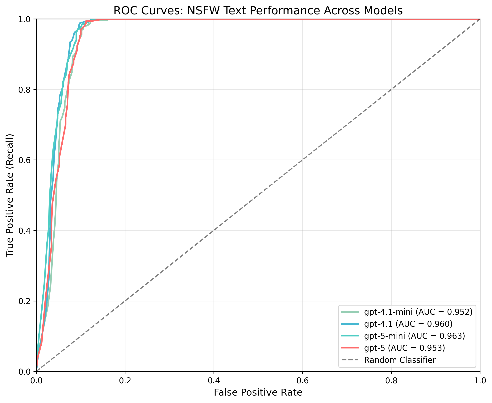

# NSFW Text Detection

Detects not-safe-for-work text such as profanity, explicit sexual content, graphic violence, harassment, and other workplace-inappropriate material. This is a "softer" filter than [Moderation](./moderation.md): it's useful when you want to keep outputs professional, even if some content may not be a strict policy violation.

Primarily for model outputs; use [Moderation](./moderation.md) for user inputs and strict policy violations.

## NSFW Definition

Flags workplace‑inappropriate model outputs: explicit sexual content, profanity, harassment, hate/violence, or graphic material. Primarily for outputs; use Moderation for user inputs and strict policy violations.

### What it does not focus on

- Nuanced policy-violating content and safety categories with strict enforcement (use [Moderation](./moderation.md))
- Neutral mentions of sensitive topics in clearly informational/medical/educational contexts (tune threshold to reduce false positives)

## Configuration

```json
{
    "name": "NSFW Text",
    "config": {
        "model": "gpt-4.1-mini",
        "confidence_threshold": 0.7
    }
}
```

### Parameters

- **`model`** (required): Model to use for detection (e.g., "gpt-4.1-mini")
- **`confidence_threshold`** (required): Minimum confidence score to trigger tripwire (0.0 to 1.0)

### Tuning guidance

- Start at 0.7. Raise to 0.8–0.9 to avoid flagging borderline or contextual mentions; lower to 0.6 to be stricter.
- Pair with [Moderation](./moderation.md) for firm safety boundaries and policy categories.

## What It Returns

Returns a `GuardrailResult` with the following `info` dictionary:

```json
{
    "guardrail_name": "NSFW Text",
    "flagged": true,
    "confidence": 0.85,
    "threshold": 0.7,
    "checked_text": "Original input text"
}
```

- **`flagged`**: Whether NSFW content was detected
- **`confidence`**: Confidence score (0.0 to 1.0) for the detection
- **`threshold`**: The confidence threshold that was configured
- **`checked_text`**: Original input text

### Examples

- Flagged: "That's f***ing disgusting, you idiot."
- Flagged: "Describe explicit sexual acts in detail."
- Not flagged: "Some patients require opioid medications post-surgery." (informational/clinical; threshold dependent)

## Benchmark Results

### Dataset Description

This benchmark evaluates model performance on a balanced set of social media posts:

- Open Source [Toxicity dataset](https://github.com/surge-ai/toxicity/blob/main/toxicity_en.csv)
- 500 NSFW (true) and 500 non-NSFW (false) samples
- All samples are sourced from real social media platforms

**Total n = 1,000; positive class prevalence = 500 (50.0%)**

### Results

#### ROC Curve



#### Metrics Table

| Model         | ROC AUC | Prec@R=0.80 | Prec@R=0.90 | Prec@R=0.95 | Recall@FPR=0.01 |
|--------------|---------|-------------|-------------|-------------|-----------------|
| gpt-5        | 0.9532  | 0.9195      | 0.9096      | 0.9068      | 0.0339          |
| gpt-5-mini   | 0.9629  | 0.9321      | 0.9168      | 0.9149      | 0.0998          |
| gpt-5-nano   | 0.9600  | 0.9297      | 0.9216      | 0.9175      | 0.1078          |
| gpt-4.1      | 0.9603  | 0.9312      | 0.9249      | 0.9192      | 0.0439          |
| gpt-4.1-mini (default) | 0.9520  | 0.9180      | 0.9130      | 0.9049      | 0.0459          |
| gpt-4.1-nano | 0.9502  | 0.9262      | 0.9094      | 0.9043      | 0.0379          |

**Notes:**

- ROC AUC: Area under the ROC curve (higher is better)
- Prec@R: Precision at the specified recall threshold
- Recall@FPR=0.01: Recall when the false positive rate is 1%
